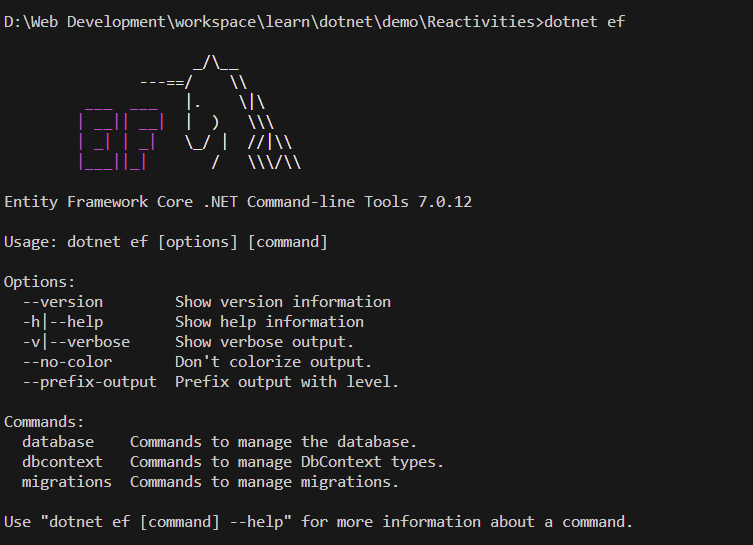

# Activities App

## API base

**Project Structure**


Check `.NET` installed versions:
```bash
dotnet --info
```
List available templates to be run using `dotnet new`, in other words list of available things you can create with the following command ([source](https://learn.microsoft.com/en-us/dotnet/core/tools/dotnet-new-list)):
```bash
dotnet new list
```
Script to create our boilerplate project, create a `create-projects-win.sh` file and copy the code below.
```bash
Write-Host "About to Create the directory" -ForegroundColor Green

mkdir Reactivities
cd Reactivities

Write-Host "About to create the solution and projects" -ForegroundColor Green
dotnet new sln
dotnet new webapi -n API
dotnet new classlib -n Application
dotnet new classlib -n Domain
dotnet new classlib -n Persistence

Write-Host "Adding projects to the solution" -ForegroundColor Green
dotnet sln add API/API.csproj
dotnet sln add Application/Application.csproj
dotnet sln add Domain/Domain.csproj
dotnet sln add Persistence/Persistence.csproj

Write-Host "Adding project references" -ForegroundColor Green
cd API
dotnet add reference ../Application/Application.csproj
cd ../Application
dotnet add reference ../Domain/Domain.csproj
dotnet add reference ../Persistence/Persistence.csproj
cd ../Persistence
dotnet add reference ../Domain/Domain.csproj
cd ..

Write-Host "Executing dotnet restore" -ForegroundColor Green
dotnet restore

Write-Host "Finished!" -ForegroundColor Green
```
Run the following command once you have this script
```bash
./create-projects-win.sh
```
Open the vscode inside the Reactivities folder with `code .` command.

Add the assets to build and debug with the following


Run the project from the `starter project` in this case the starter project is API folder so we move to the API folder (`cd API/`) and execute the followind command:
```bash
dotnet run
```

Inside `API/Properties/launchSettings.json` we need to modify so we have the following
```json
{
  "$schema": "https://json.schemastore.org/launchsettings.json",
  "profiles": {
    "http": {
      "commandName": "Project",
      "dotnetRunMessages": true,
      "launchBrowser": false,
      "applicationUrl": "http://localhost:5000",
      "environmentVariables": {
        "ASPNETCORE_ENVIRONMENT": "Development"
      }
    }
  }
}
```
Now inside our project the **main entry point** file is `API/Program.cs` this is the entry point for any `.NET` application.

The configuration files are:
* `API/appsettings.Development.json`
* `API/appsettings.json`

Change our file `API\appsettings.Development.json`:
```json
{
  "Logging": {
    "LogLevel": {
      "Default": "Information",
      "Microsoft.AspNetCore": "Information"
    }
  }
}
```
Think of services as things that we use inside our application.
Modifiy `API/Program.cs` so we have:
```cs
var builder = WebApplication.CreateBuilder(args);

// Add services to the container.

builder.Services.AddControllers();
// Learn more about configuring Swagger/OpenAPI at https://aka.ms/aspnetcore/swashbuckle
builder.Services.AddEndpointsApiExplorer();
builder.Services.AddSwaggerGen();

var app = builder.Build();

// Configure the HTTP request pipeline.(middleware)
if (app.Environment.IsDevelopment())
{
    app.UseSwagger();
    app.UseSwaggerUI();
}

app.UseAuthorization();

app.MapControllers();

app.Run();

```
Modify our `API/API.csproj` file with
```cs
<Project Sdk="Microsoft.NET.Sdk.Web">

  <PropertyGroup>
    <TargetFramework>net7.0</TargetFramework>
    <Nullable>disable</Nullable>
    <ImplicitUsings>enable</ImplicitUsings>
  </PropertyGroup>

  <ItemGroup>
    <PackageReference Include="Microsoft.AspNetCore.OpenApi" Version="7.0.12" />
    <PackageReference Include="Swashbuckle.AspNetCore" Version="6.5.0" />
  </ItemGroup>

  <ItemGroup>
    <ProjectReference Include="..\Application\Application.csproj" />
  </ItemGroup>

</Project>
```

Hide(exclude) our files `bin/`,`obj/` on vscode


Create an `Activity` class in `Domain/` with the following:
```cs
namespace Domain
{
  public class Activity
  {
    public Guid Id { get; set; }
    public string Title { get; set; }
    public DateTime Date { get; set; }
    public string Description { get; set; }
    public string Category { get; set; }
    public string City { get; set; }
    public string Venue { get; set; }
  }
}
```
Add the following extension, [check](https://learn.microsoft.com/en-us/ef/core/dbcontext-configuration/#configuring-the-database-provider).

After this add this `DataContext` class to `Persistence/` folder
```cs
using Domain;
using Microsoft.EntityFrameworkCore;

namespace Persistence
{
  public class DataContext : DbContext
  {
    public DataContext(DbContextOptions options) : base(options)
    {
    }

    public DbSet<Activity> Activities { get; set; }
  }
}
```
|<span style="color:purple">Definition</span>|
|---|
|<span style="color:purple">A DbContext instance represents a session with the database and can be used to query and save instances of your entities. DbContext is a combination of the Unit Of Work and Repository patterns.</span> *[Details+](https://learn.microsoft.com/en-us/dotnet/api/microsoft.entityframeworkcore.dbcontext?view=efcore-7.0)*|

We need to execute the following on the level where is our `Reactivities.sln` file that's the root folder
```bash
dotnet restore
```
Once done this we add the following code into `Program.cs` file
```cs
// Add services to the container.

builder.Services.AddControllers();
// Learn more about configuring Swagger/OpenAPI at https://aka.ms/aspnetcore/swashbuckle
builder.Services.AddEndpointsApiExplorer();
builder.Services.AddSwaggerGen();
builder.Services.AddDbContext<DataContext>(opt =>
{
    string pgHost = Environment.GetEnvironmentVariable("DATABASE_HOST");
    string pgPort = Environment.GetEnvironmentVariable("DATABASE_PORT");
    string pgUser = Environment.GetEnvironmentVariable("DATABASE_USER");
    string pgPass = Environment.GetEnvironmentVariable("DATABASE_PASSWORD");
    string pgDb = Environment.GetEnvironmentVariable("DATABASE_NAME");

    string connectionString = $"Server={pgHost};Port={pgPort};User Id={pgUser};Password={pgPass};Database={pgDb};";
    
    opt.UseNpgsql(connectionString);
});

var app = builder.Build();
```
As you can see we're going to use postgres so we need a place to save our database like a container:
```bash
docker run --name postgres-demo -e POSTGRES_USER=admin -e POSTGRES_PASSWORD=secret -p 5432:5432 -d postgres:latest
```

To generate the schema we're going to need to install the following [tool](https://www.nuget.org/packages/dotnet-ef). Chech the running `.NET` version matches the following command (you can get this line from the tool website).
```bash
dotnet tool install --global dotnet-ef --version 7.0.12
```
Once you installed this tool if you write on the console `dotnet ef` the content below will be displayed.


Install from Nuget gallery `Microsoft.EntityFrameworkCore.Design` into our `API` project

After this our API.csproj will look like this:
```xml
<Project Sdk="Microsoft.NET.Sdk.Web">

  <PropertyGroup>
    <TargetFramework>net7.0</TargetFramework>
    <Nullable>disable</Nullable>
    <ImplicitUsings>enable</ImplicitUsings>
  </PropertyGroup>

  <ItemGroup>
    <PackageReference Include="Microsoft.AspNetCore.OpenApi" Version="7.0.12" />
    <PackageReference Include="Microsoft.EntityFrameworkCore.Design" Version="7.0.12">
      <IncludeAssets>runtime; build; native; contentfiles; analyzers; buildtransitive</IncludeAssets>
      <PrivateAssets>all</PrivateAssets>
    </PackageReference>
    <PackageReference Include="Swashbuckle.AspNetCore" Version="6.5.0" />
  </ItemGroup>

  <ItemGroup>
    <ProjectReference Include="..\Application\Application.csproj" />
  </ItemGroup>

</Project>

```
With the `Microsoft.EntityFrameworkCore.Design` added.

Once this is done now we can do our first migration
```bash
dotnet ef migrations add InitialCreate -s API -p Persistence
```
After execute the previous command we're going to have the following `Migrations` directory.


We need to create the Database so we need to add this code in `Project`
```cs
...
app.MapControllers();

using var scope = app.Services.CreateScope();
var services = scope.ServiceProvider;

try
{
    var context = services.GetRequiredService<DataContext>();
    context.Database.Migrate();
}
catch (Exception ex)
{
    var logger = services.GetRequiredService<ILogger<Program>>();
    logger.LogError(ex, "An error occured during migration");
}
...
```
Now we execute the following command in the startert project(`API/` folder) to create the database:
```bash
dotnet watch
```
We'll have the following result


Now we need put some data in our table so we're going to create `Seed.cs` file to set data into our `Persistence` folder.
```cs
using Domain;

namespace Persistence
{
  public class Seed
  {
    public static async Task SeedData(DataContext context)
    {
      if (context.Activities.Any()) return;

      var activities = new List<Activity>
            {
                new Activity
                {
                    Title = "Past Activity 1",
                    Date = DateTime.UtcNow.AddMonths(-2),
                    Description = "Activity 2 months ago",
                    Category = "drinks",
                    City = "London",
                    Venue = "Pub",
                },
                new Activity
                {
                    Title = "Past Activity 2",
                    Date = DateTime.UtcNow.AddMonths(-1),
                    Description = "Activity 1 month ago",
                    Category = "culture",
                    City = "Paris",
                    Venue = "Louvre",
                },
                new Activity
                {
                    Title = "Future Activity 1",
                    Date = DateTime.UtcNow.AddMonths(1),
                    Description = "Activity 1 month in future",
                    Category = "culture",
                    City = "London",
                    Venue = "Natural History Museum",
                },
                new Activity
                {
                    Title = "Future Activity 2",
                    Date = DateTime.UtcNow.AddMonths(2),
                    Description = "Activity 2 months in future",
                    Category = "music",
                    City = "London",
                    Venue = "O2 Arena",
                },
                new Activity
                {
                    Title = "Future Activity 3",
                    Date = DateTime.UtcNow.AddMonths(3),
                    Description = "Activity 3 months in future",
                    Category = "drinks",
                    City = "London",
                    Venue = "Another pub",
                },
                new Activity
                {
                    Title = "Future Activity 4",
                    Date = DateTime.UtcNow.AddMonths(4),
                    Description = "Activity 4 months in future",
                    Category = "drinks",
                    City = "London",
                    Venue = "Yet another pub",
                },
                new Activity
                {
                    Title = "Future Activity 5",
                    Date = DateTime.UtcNow.AddMonths(5),
                    Description = "Activity 5 months in future",
                    Category = "drinks",
                    City = "London",
                    Venue = "Just another pub",
                },
                new Activity
                {
                    Title = "Future Activity 6",
                    Date = DateTime.UtcNow.AddMonths(6),
                    Description = "Activity 6 months in future",
                    Category = "music",
                    City = "London",
                    Venue = "Roundhouse Camden",
                },
                new Activity
                {
                    Title = "Future Activity 7",
                    Date = DateTime.UtcNow.AddMonths(7),
                    Description = "Activity 2 months ago",
                    Category = "travel",
                    City = "London",
                    Venue = "Somewhere on the Thames",
                },
                new Activity
                {
                    Title = "Future Activity 8",
                    Date = DateTime.UtcNow.AddMonths(8),
                    Description = "Activity 8 months in future",
                    Category = "film",
                    City = "London",
                    Venue = "Cinema",
                }
            };

      await context.Activities.AddRangeAsync(activities);
      await context.SaveChangesAsync();
    }
  }
}
```
We're going to modify our `Program.cs` in `API`
```cs
var services = scope.ServiceProvider;

try
{
    ...
    await Seed.SeedData(context);//This is the line we need
}
```
We need to run the following command that is better in the following way:
```bash
dotnet watch --no-hot-reload
```
Once the migration is done, we need to add our first controller, so we need to create a`API/Controllers/BaseApiController.cs`file:
```cs
using Microsoft.AspNetCore.Mvc;

namespace API.Controllers
{
    [ApiController]
    [Route("api/[controller]")]
    public class BaseApiController : ControllerBase
    {
        
    }
}
```
Remove the `this` keyword generated during the process to use `_`

After this we're going to create our next one `API/Controllers/ActivitiesController.cs`:
```cs
using Domain;
using Microsoft.AspNetCore.Mvc;
using Microsoft.EntityFrameworkCore;
using Persistence;

namespace API.Controllers
{
    public class ActivitiesController : BaseApiController
    {
        private readonly DataContext _context;
        public ActivitiesController(DataContext context)
        {
            _context = context;
        }

        [HttpGet] // api/activities
        public async Task<ActionResult<List<Activity>>> GetActivities()
        {
            return await _context.Activities.ToListAsync();
        }

        [HttpGet("{id}")] // api/activities/12321activity
        public async Task<ActionResult<Activity>> GetActivity(Guid id)
        {
            return await _context.Activities.FindAsync(id);
        }
    }
}
```
Now we have our basic api done, and we can start a repository with git.
```bash
git init
```
Add a gitignore
```
dotnet new gitignore
```
After this we just add the following file name `appsettings`, since we can have third parties keys, into our gitignore file:
```bash
## Get latest from https://github.com/github/gitignore/blob/main/VisualStudio.gitignore

appsettings.json

# User-specific files
```
once this is done create a repository on github and follow the steps after git commit.

When we need to enable CORS do the following in the `API/Program.cs`, [check about adding policy](https://learn.microsoft.com/en-us/aspnet/core/security/cors?view=aspnetcore-7.0#cors-with-named-policy-and-middleware).
```cs
    opt.UseNpgsql(connectionString);
});
builder.Services.AddCors(opt => {
    opt.AddPolicy("CorsPolicy", policy =>
    {
        policy.AllowAnyHeader().AllowAnyMethod().WithOrigins("http://localhost:3000");
    });
});

var app = builder.Build();

// Configure the HTTP request pipeline.(middleware)
if (app.Environment.IsDevelopment())
{
    app.UseSwagger();
    app.UseSwaggerUI();
}


app.UseCors("CorsPolicy");

app.UseAuthorization();
```

## Creating a CRUD applicaton using the CQRS + Mediator pattern

We need to install the MediatR nugget inside the Application.csproj


We're going to add `Application\Activities\List.cs`
```cs
using Domain;
using MediatR;
using Microsoft.EntityFrameworkCore;
using Persistence;

namespace Application.Activities
{
  public class List
  {
    public class Query : IRequest<List<Activity>> { }

    public class Handler : IRequestHandler<Query, List<Activity>>
    {
      private readonly DataContext _context;
      public Handler(DataContext context)
      {
        _context = context;

      }
      public async Task<List<Activity>> Handle(Query request, CancellationToken cancellationToken)
      {
        return await _context.Activities.ToListAsync();
      }
    }
  }
}
```
We need to modify our `API\Controllers\ActivitiesController.cs` controller adding mediator:
```cs
using Application.Activities;
using Domain;
using MediatR;
using Microsoft.AspNetCore.Mvc;
using Microsoft.EntityFrameworkCore;
using Persistence;

namespace API.Controllers
{
    public class ActivitiesController : BaseApiController
    {
        private readonly IMediator _mediator;
        public ActivitiesController(IMediator mediator)
        {
            _mediator = mediator;
        }

        [HttpGet] // api/activities
        public async Task<ActionResult<List<Activity>>> GetActivities()
        {
            return await _mediator.Send(new List.Query());
        }

        [HttpGet("{id}")] // api/activities/123adfa
        public async Task<ActionResult<Activity>> GetActivity(Guid id)
        {
            return Ok();
        }
    }
}
```
We need to tell our application(`API\Program.cs`) about mediator, **we just and one handler and the others will be added automatically**:
```cs
    opt.AddPolicy("CorsPolicy", policy =>
    {
        policy.AllowAnyHeader().AllowAnyMethod().WithOrigins("http://localhost:3000");
    });
});
// Adding Mediator
builder.Services.AddMediatR(cfg => cfg.RegisterServicesFromAssembly(typeof(List.Handler).Assembly));

var app = builder.Build();
```
We can make our controller's code thin by moving our logic from `ActivitiesController` to `BaseApiController`:
```cs
using MediatR;
using Microsoft.AspNetCore.Mvc;

namespace API.Controllers
{
    [ApiController]
    [Route("api/[controller]")]
    public class BaseApiController : ControllerBase
    {
        private IMediator _mediator;

        protected IMediator Mediator => _mediator ??= HttpContext.RequestServices.GetRequiredService<IMediator>();
    }
}
```
```cs
using Application.Activities;
using Domain;
using MediatR;
using Microsoft.AspNetCore.Mvc;
using Microsoft.EntityFrameworkCore;
using Persistence;

namespace API.Controllers
{
    public class ActivitiesController : BaseApiController
    {
        [HttpGet] // api/activities
        public async Task<ActionResult<List<Activity>>> GetActivities()
        {
            return await Mediator.Send(new List.Query());
        }

        [HttpGet("{id}")] // api/activities/123adfa
        public async Task<ActionResult<Activity>> GetActivity(Guid id)
        {
            return Ok();
        }
    }
}
```
With this all above we get just the Activities, now we need to get just one Activity details, we need to build a `Application\Activities\Details.cs`:
```cs
using Domain;
using MediatR;
using Persistence;

namespace Application.Activities
{
    public class Details
    {
        public class Query : IRequest<Activity>
        {
            public Guid Id { get; set; }
        }

        public class Handler : IRequestHandler<Query, Activity>
        {
            private readonly DataContext _context;
            public Handler(DataContext context)
            {
                _context = context;

            }
            public async Task<Activity> Handle(Query request, CancellationToken cancellationToken)
            {
                return await _context.Activities.FindAsync(request.Id);
            }
        }
    }
}
```
After this we need to modify our `API\Controllers\ActivitiesController.cs`:
```cs
using Application.Activities;
using Domain;
using MediatR;
using Microsoft.AspNetCore.Mvc;
using Microsoft.EntityFrameworkCore;
using Persistence;

namespace API.Controllers
{
    public class ActivitiesController : BaseApiController
    {
        [HttpGet] // api/activities
        public async Task<ActionResult<List<Activity>>> GetActivities()
        {
            return await Mediator.Send(new List.Query());
        }

        [HttpGet("{id}")] // api/activities/123adfa
        public async Task<ActionResult<Activity>> GetActivity(Guid id)
        {
            return await Mediator.Send(new Details.Query{Id = id});
        }
    }
}
```
We need to map properties comming from the request we need:
