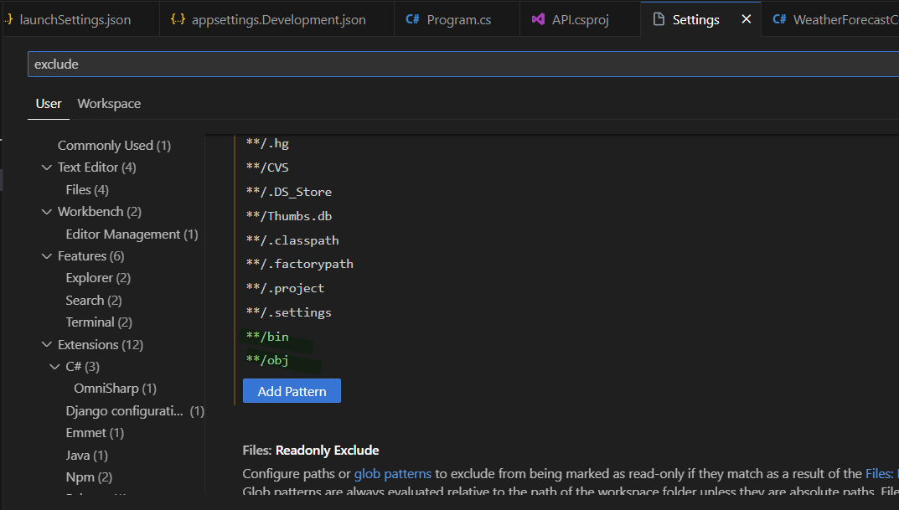

# Activities App

## API base

**Project Structure**


Check `.NET` installed versions:
```bash
dotnet --info
```
List available templates to be run using `dotnet new`, in other words list of available things you can create with the following command ([source](https://learn.microsoft.com/en-us/dotnet/core/tools/dotnet-new-list)):
```bash
dotnet new list
```
Script to create our boilerplate project, create a `create-projects-win.sh` file and copy the code below.
```bash
Write-Host "About to Create the directory" -ForegroundColor Green

mkdir Reactivities
cd Reactivities

Write-Host "About to create the solution and projects" -ForegroundColor Green
dotnet new sln
dotnet new webapi -n API
dotnet new classlib -n Application
dotnet new classlib -n Domain
dotnet new classlib -n Persistence

Write-Host "Adding projects to the solution" -ForegroundColor Green
dotnet sln add API/API.csproj
dotnet sln add Application/Application.csproj
dotnet sln add Domain/Domain.csproj
dotnet sln add Persistence/Persistence.csproj

Write-Host "Adding project references" -ForegroundColor Green
cd API
dotnet add reference ../Application/Application.csproj
cd ../Application
dotnet add reference ../Domain/Domain.csproj
dotnet add reference ../Persistence/Persistence.csproj
cd ../Persistence
dotnet add reference ../Domain/Domain.csproj
cd ..

Write-Host "Executing dotnet restore" -ForegroundColor Green
dotnet restore

Write-Host "Finished!" -ForegroundColor Green
```
Run the following command once you have this script
```bash
./create-projects-win.sh
```
Open the vscode inside the Reactivities folder with `code .` command.

Add the assets to build and debug with the following


Run the project from the `starter project` in this case the starter project is API folder so we move to the API folder (`cd API/`) and execute the followind command:
```bash
dotnet run
```

Inside `API/Properties/launchSettings.json` we need to modify so we have the following
```json
{
  "$schema": "https://json.schemastore.org/launchsettings.json",
  "profiles": {
    "http": {
      "commandName": "Project",
      "dotnetRunMessages": true,
      "launchBrowser": false,
      "applicationUrl": "http://localhost:5000",
      "environmentVariables": {
        "ASPNETCORE_ENVIRONMENT": "Development"
      }
    }
  }
}
```
Now inside our project the **main entry point** file is `API/Program.cs` this is the entry point for any `.NET` application.

The configuration files are:
* `API/appsettings.Development.json`
* `API/appsettings.json`

Chage our file `API\appsettings.Development.json`:
```json
{
  "Logging": {
    "LogLevel": {
      "Default": "Information",
      "Microsoft.AspNetCore": "Information"
    }
  }
}
```
Think of services as things that we use inside our application.
Modifiy `API/Program.cs` so we have:
```cs
var builder = WebApplication.CreateBuilder(args);

// Add services to the container.

builder.Services.AddControllers();
// Learn more about configuring Swagger/OpenAPI at https://aka.ms/aspnetcore/swashbuckle
builder.Services.AddEndpointsApiExplorer();
builder.Services.AddSwaggerGen();

var app = builder.Build();

// Configure the HTTP request pipeline.(middleware)
if (app.Environment.IsDevelopment())
{
    app.UseSwagger();
    app.UseSwaggerUI();
}

app.UseAuthorization();

app.MapControllers();

app.Run();

```
Modify our `API/API.csproj` file with
```cs
<Project Sdk="Microsoft.NET.Sdk.Web">

  <PropertyGroup>
    <TargetFramework>net7.0</TargetFramework>
    <Nullable>disable</Nullable>
    <ImplicitUsings>enable</ImplicitUsings>
  </PropertyGroup>

  <ItemGroup>
    <PackageReference Include="Microsoft.AspNetCore.OpenApi" Version="7.0.12" />
    <PackageReference Include="Swashbuckle.AspNetCore" Version="6.5.0" />
  </ItemGroup>

  <ItemGroup>
    <ProjectReference Include="..\Application\Application.csproj" />
  </ItemGroup>

</Project>
```

Hide(exclude) our files `bin/`,`obj/` on vscode


Create an `Activity` class in `Domain/` with the following:
```cs
namespace Domain
{
  public class Activity
  {
    public Guid Id { get; set; }
    public string Title { get; set; }
    public DateTime Date { get; set; }
    public string Description { get; set; }
    public string Category { get; set; }
    public string City { get; set; }
    public string Venue { get; set; }
  }
}
```
Add the following extension, [check](https://learn.microsoft.com/en-us/ef/core/dbcontext-configuration/#configuring-the-database-provider).

After this add this `DataContext` class to `Persistence/` folder
```cs
using Domain;
using Microsoft.EntityFrameworkCore;

namespace Persistence
{
  public class DataContext : DbContext
  {
    public DataContext(DbContextOptions options) : base(options)
    {
    }

    public DbSet<Activity> Activities { get; set; }
  }
}
```
We need to execute the following on the level where is our `Reactivities.sln` file that's the root folder
```bash
dotnet restore
```
Once done this we add the following code into `Program.cs` file
```cs
// Add services to the container.

builder.Services.AddControllers();
// Learn more about configuring Swagger/OpenAPI at https://aka.ms/aspnetcore/swashbuckle
builder.Services.AddEndpointsApiExplorer();
builder.Services.AddSwaggerGen();
builder.Services.AddDbContext<DataContext>(opt =>
{
    string pgHost = Environment.GetEnvironmentVariable("DATABASE_HOST");
    string pgPort = Environment.GetEnvironmentVariable("DATABASE_PORT");
    string pgUser = Environment.GetEnvironmentVariable("DATABASE_USER");
    string pgPass = Environment.GetEnvironmentVariable("DATABASE_PASSWORD");
    string pgDb = Environment.GetEnvironmentVariable("DATABASE_NAME");

    string connectionString = $"Server={pgHost};Port={pgPort};User Id={pgUser};Password={pgPass};Database={pgDb};";
    
    opt.UseNpgsql(connectionString);
});

var app = builder.Build();
```
To generate the schema we're going to need to install the following [tool](https://www.nuget.org/packages/dotnet-ef). Chech the running `.NET` version matches the following command (you can get this line from the tool website).
```bash
dotnet tool install --global dotnet-ef --version 7.0.12
```

Install from Nuget gallery `Microsoft.EntityFrameworkCore.Design` into our `API` project


Once this is done now we can do our first migration
```bash
dotnet ef migrations add InitialCreate -s API -p Persistence
```
After execute the previous command we're going to have the following `Migrations` directory.


We need to create the Database so we need to add this code in `Project`
```cs
...
app.MapControllers();

using var scope = app.Services.CreateScope();
var services = scope.ServiceProvider;

try
{
    var context = services.GetRequiredService<DataContext>();
    context.Database.Migrate();
}
catch (Exception ex)
{
    var logger = services.GetRequiredService<ILogger<Program>>();
    logger.LogError(ex, "An error occured during migration");
}
...
```
Now we execute the following command:
```bash
dotnet watch
```