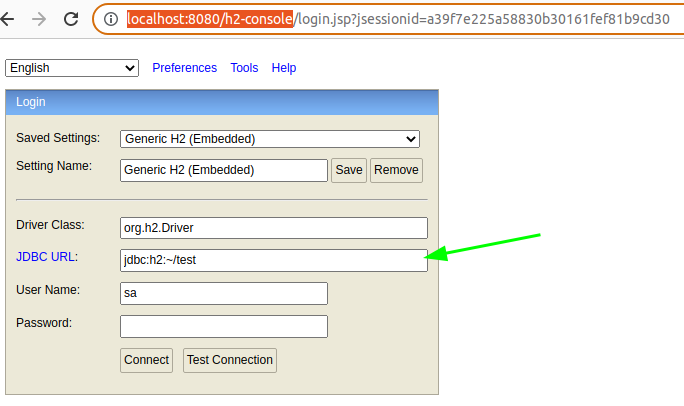
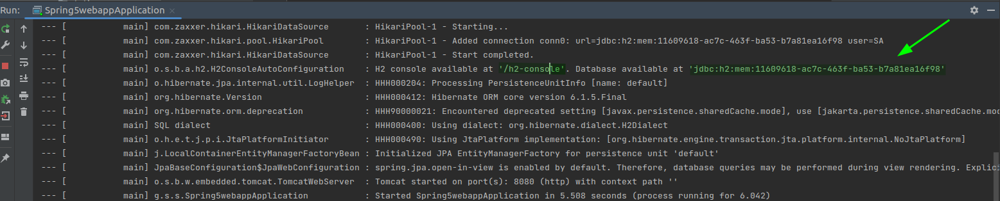

# JPA

# Table Contents
* [Concept](#concept)
* [Requirements](#requirements)
* [Define an JPA entity(Example)](#define-an-jpa-entityexample)
* [Tools](#tools)
* [More information](#more-information)

## Concept
JPA (Java Persistent API)
It's a popular **Spring Data** project.
JPA is available to Spring Boot applications with the JPA starter

## Requirements

* Dependencies and select **Spring Data JPA** and then **H2 Database**.
* JPA entity needs a default constructor or zero args constructor, you do not use it directly, so it is designated as ``protected``.
* JPA entity is annotated with ``@Entity``, indicating that it is a JPA entity.

## Define an JPA entity(Example Guru)
We have an example who to use tags to define JPA entities and mapping these.

We define a relationship between three POJOs Book, Author and Publisher, after we added the following constraints:

* The Author, Book and Publisher classes are annotated with **@Entity** indicating that it is a JPA entity.
```java
@Entity // This define de POJO as a JPA entity
public class Author {
  ...
}
```

* JPA does require a zero args constructor(The default constructor exists only for the sake of JPA, You do not use it directly, so it is designated as protected).

* The object's *Id* property is annotated with **@Id** so that JPA recognizes it as the object's ID, also the *Id* property is annotated with @GenerateValue to indicate the *Id* should be generated automatically, this tells hibernate how it is getting generated.

```java
@Entity
public class Author {
  ...
  @Id
  @GeneratedValue(strategy = GenerationType.AUTO)
  private Long Id;
  ...
  public Author() {
    //We need a zero args constructor
  }
  ...
  @Override
  public boolean equals(Object o) {
    if (this == o) return true;
    if (o == null || getClass() != o.getClass()) return false;

    Author author = (Author) o;

    return id != null ? id.equals(author.id) : author.id == null;
  }

  @Override
  public int hashCode() {
    return id != null ? id.hashCode() : 0;
  }
}
```
For the mapping we have the following:
* Author has many Book(s)
* Book has many Author(s)
* Publisher has many Book(s)
* Book has one Publisher

For Author Books relationship the owning side is going to be Author and the non-owning side is Author. So the **join table is specified on the owning side**(Book) and the **mappedBy** element must be use on the non-owning(Author).

We added the following tags for the POJOS
```java
@Entity
public class Author {

  @Id
  @GeneratedValue(strategy = GenerationType.AUTO)
  private Long id;

  ...

  // mappedBy used on the non-owning side
  @ManyToMany(mappedBy = "authors")
  private Set<Book> books = new HashSet<>();

  ...
}
```
```java
@Entity
public class Book {
  @Id
  @GeneratedValue(strategy =  GenerationType.AUTO)
  private Long Id;

  // These books to one publisher
  // 
  @ManyToOne
  private Publisher publisher;

  // Definde the relationship on the owning side
  @ManyToMany
  // Create this is going to hold the relationship between records on the author table
  // and records on the book table
  @JoinTable(
    name = "author_book",
    joinColumns = @JoinColumn(name = "book_id"),
    inverseJoinColumns = @JoinColumn(name = "author_id")
  )
  private Set<Author> authors = new HashSet<>();
  ...
}
```
```java
@Entity
public class Publisher {
  @Id
  @GeneratedValue(strategy = GenerationType.AUTO)
  private Long id;

  @OneToMany
  @JoinColumn(name = "publisher_id")
  private Set<Book> books = new HashSet<>();
  ...
}
```

## Tools
### H2 console

To enable **H2 console** add on *src/main/resources/application.properties* the following line:
```bash
spring.h2.console.enabled=true
```
After this you will be able to access to the ``h2 console`` in the following ip ``http://localhost:8080/h2-console`` in your work environment


check also the configuration on logs(example):

You must set this configuration ``jdbc:h2:mem:11609618-ac7c-463f-ba53-b7a81ea16f98`` on the ``JDBC URL`` field on the login form, and click on ``connect``.

## More information
* [Spring Data projects](https://spring.io/projects/spring-data)
* [Accessing Data with JPA](https://spring.io/guides/gs/accessing-data-jpa/)
* [Hibernate User Guide Annotations](https://docs.jboss.org/hibernate/orm/6.1/userguide/html_single/Hibernate_User_Guide.html#annotations)
* [Annotation Type ManyToMany](https://javaee.github.io/javaee-spec/javadocs/javax/persistence/ManyToMany.html)
* [Accessing Data with JPA](https://spring.io/guides/gs/accessing-data-jpa/)