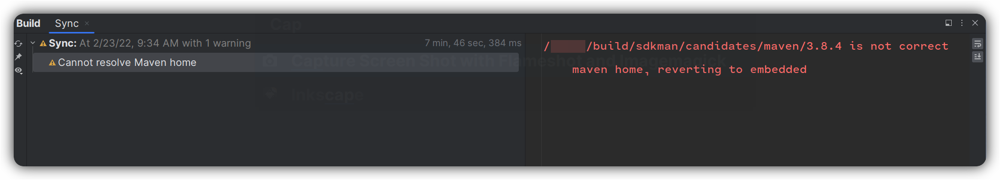
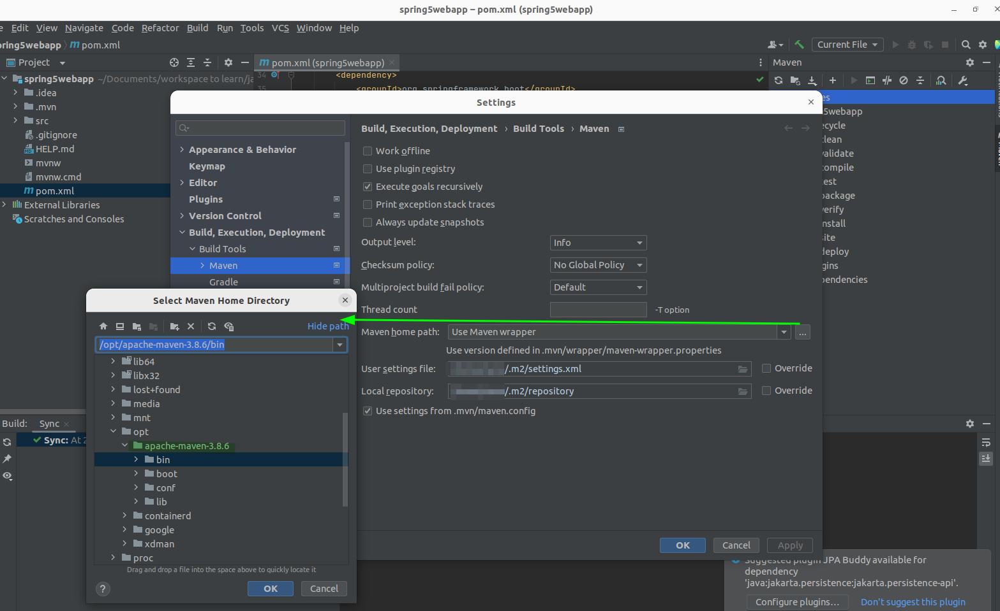
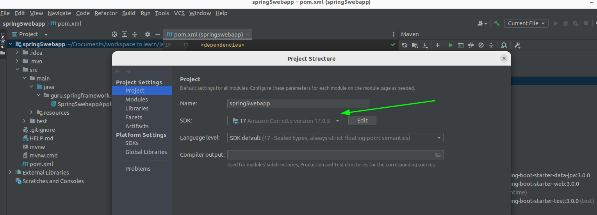
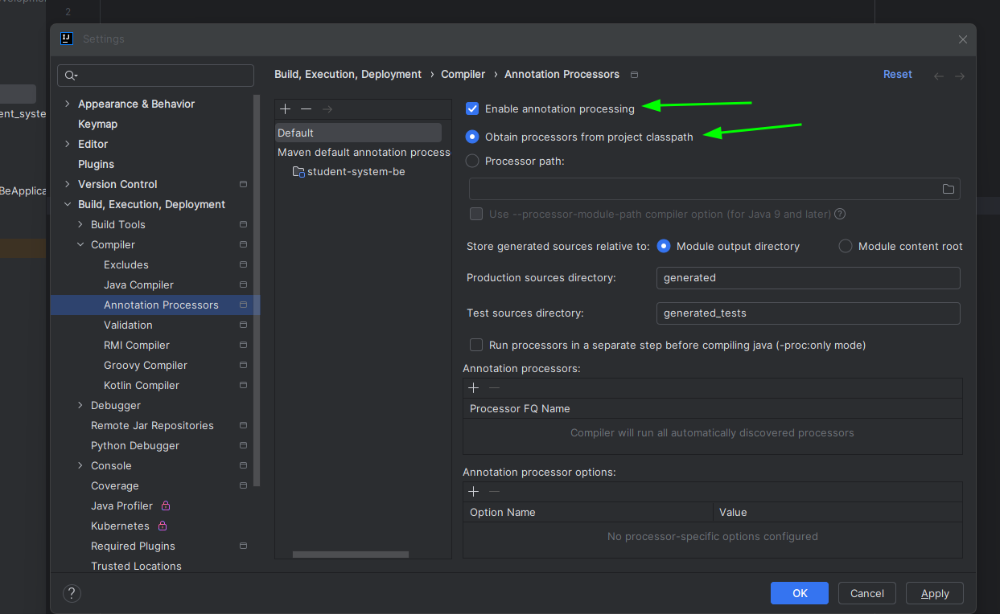
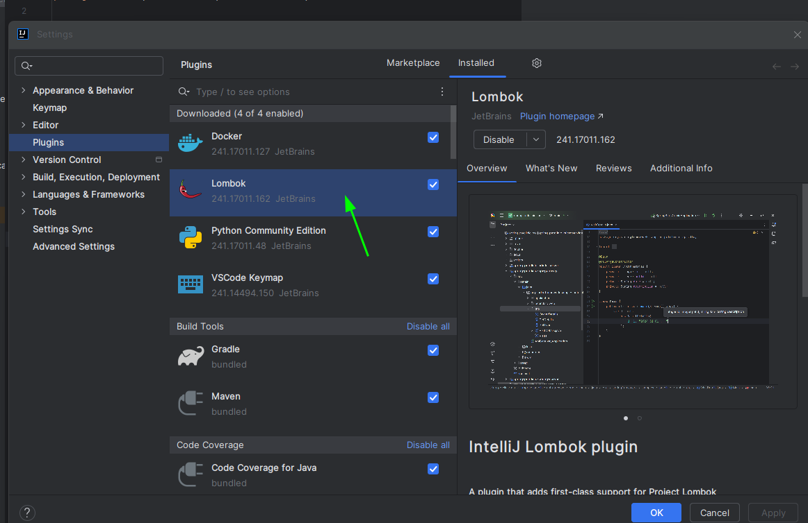

# Development Environment

# Table of Contents
1. [What do you need for spring ?](#what-do-you-need-for-spring)
2. [Using amazon corretto](#amazon-corretto)
3. [Setup Maven for intellij](#setup-maven-for-intellij)
4. [How to open a project created with spring initializr using intellij](#how-to-open-a-project-created-with-spring-initializr-using-intellij)
5. [Environment variables in spring](#environment-variables)

## What do you need for spring ?
You need the following tools

### Amazon Corretto
You can download the java jdk from this [page](https://docs.aws.amazon.com/corretto/latest/corretto-17-ug/generic-linux-install.html), probably it will not work because the version is old so you need to explore the `linux` option.

After the installation you can verify with:
```bash
java -version
```
With this expected output:
```bash
openjdk version "17;.0.0" 2021-09-14 LTS
OpenJDK Runtime Environment Corretto-17;.0.0.35.1 (build 17;+35-LTS)
OpenJDK 64-Bit Server VM Corretto-17;.0.0.35.1 (build 17;+35-LTS, mixed mode, sharing)
```
This is the cool thing about Corretto you can choose the version you want, let's see which are available with and choose the version you want:
```bash
sudo update-alternatives --config java
```
These are the available versions:
```bash
There are 4 choices for the alternative java (providing /usr/bin/java).

  Selection    Path                                            Priority   Status
------------------------------------------------------------
  0            /usr/lib/jvm/java-17-amazon-corretto/bin/java    11700002  auto mode
* 1            /usr/lib/jvm/java-11-amazon-corretto/bin/java    11100014  manual mode
  2            /usr/lib/jvm/java-11-openjdk-amd64/bin/java      1111      manual mode
  3            /usr/lib/jvm/java-17-amazon-corretto/bin/java    11700002  manual mode
  4            /usr/lib/jvm/java-8-openjdk-amd64/jre/bin/java   1081      manual mode
```
If you want uninstall you can check this [page](https://docs.aws.amazon.com/corretto/latest/corretto-17-ug/generic-linux-install.html).
### Java JDK
Check if you have installed with:
```bash
java --version && javac --version
openjdk 11.0.14.1 2022-02-08 LTS
OpenJDK Runtime Environment Corretto-11.0.14.10.1 (build 11.0.14.1+10-LTS)
OpenJDK 64-Bit Server VM Corretto-11.0.14.10.1 (build 11.0.14.1+10-LTS, mixed mode)
openjdk 11.0.14.1 2022-02-08 LTS
OpenJDK Runtime Environment Corretto-11.0.14.10.1 (build 11.0.14.1+10-LTS)
OpenJDK 64-Bit Server VM Corretto-11.0.14.10.1 (build 11.0.14.1+10-LTS, mixed mode)
```
### Maven

#### Installing Maven

Download Maven Binaries:
```bash
$ wget https://dlcdn.apache.org/maven/maven-3/3.8.6/binaries/apache-maven-3.8.6-bin.tar.gz
$ tar -xvf apache-maven-3.8.6-bin.tar.gz
$ mv apache-maven-3.8.6 /opt/
```
Set the following configuration on the ``.profile`` file
```bash
# maven java configuration
JAVA_HOME='/usr/lib/jvm/java-17-amazon-corretto'
PATH="$JAVA_HOME/bin:$PATH"
export PATH
M2_HOME='/opt/apache-maven-3.8.6'
PATH="$M2_HOME/bin:$PATH"
export PATH
```
Excute the following command
```bash
source .profile
```

```bash
mvn --version
Apache Maven 3.6.3
Maven home: /usr/share/maven
Java version: 11.0.14.1, vendor: Amazon.com Inc., runtime: /usr/lib/jvm/java-11-amazon-corretto
Default locale: en_US, platform encoding: UTF-8
OS name: "linux", version: "5.4.0-113-generic", arch: "amd64", family: "unix"
```
#### Installing Gradle
In File Explorer right-click on the This PC (or Computer) icon, then click Properties -> Advanced System Settings -> Environmental Variables.

Under System Variables select Path, then click Edit. Add an entry for `C:\Gradle\gradle-8.6\bin`. Click OK to save.
[More info](https://gradle.org/install/)
#### Gradle
```bash
gradle --version

------------------------------------------------------------
Gradle 7.4.2
------------------------------------------------------------

Build time:   2022-03-31 15:25:29 UTC
Revision:     540473b8118064efcc264694cbcaa4b677f61041

Kotlin:       1.5.31
Groovy:       3.0.9
Ant:          Apache Ant(TM) version 1.10.11 compiled on July 10 2021
JVM:          11.0.14.1 (Amazon.com Inc. 11.0.14.1+10-LTS)
OS:           Linux 5.4.0-113-generic amd64
```

## Setup Maven for intellij
To avoid this problem

Setup the following config:


Setup java version

## How to open a project created with spring initializr using intellij

We need to take the files from the zip and open a project from intellij selection the **pom.xml** file

## How to setup Lombok
If you wanna use Lombok install the plugin and select the following configuration on intellij.



## Environment Variables
If you wanna setup env variables on Spring Boot you can follow [this](https://www.youtube.com/watch?v=PmGLn3ua_lU&t=712s).