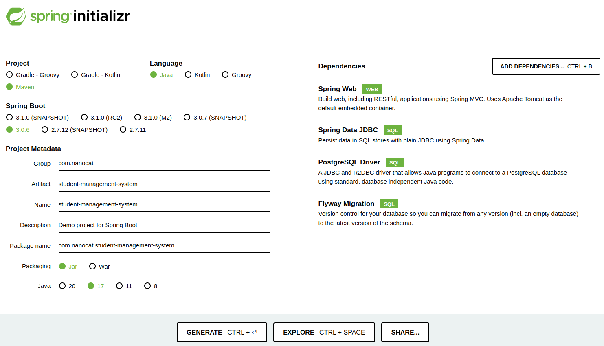
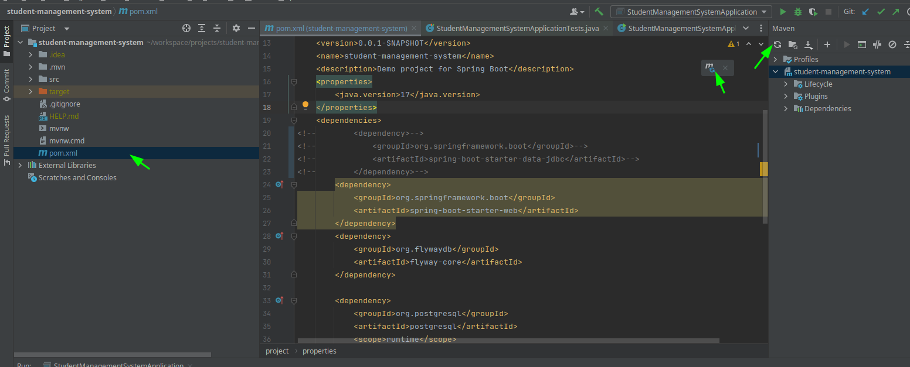
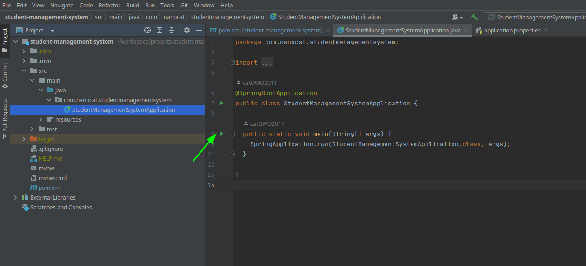

# Student Management System

[Project Link](https://github.com/catOWO2011/student-management-system)

1. [Generate the project with spring initializr](#1-generate-the-project-with-spring-initializr)
2. [Run the project](#run-the-project)
3. [Create the POJO Student](#create-the-pojo-student)
4. [Create a Student Controller](#create-a-student-controller)
5. [Add WebMvcConfigurer to expose the API](#5-add-webmvcconfigurer-to-expose-the-api)
6. [Working with Application Properties](#6-working-with-application-properties)
7. [Creating a docker container to host our records with postgresql](#7-creating-a-docker-container-to-host-our-records-with-postgresql)
8. [Connect our app with postgres](#8-connect-our-app-with-postgres)
9. [Service Layer](#9-service-layer)
10. [Integrating with the Database](#10-interactiong-with-the-database)
11. [Deployment](#11-deployment)
12. [Create Student Endpoint](#12-create-student-endpoint)

[Reference](#reference)

## 1. Generate the project with spring initializr

Go to this [link](https://start.spring.io/), we'll use some dependencies, it'll look like this, the name of the project is `student-management-system`.

After this we generate the project.

Open the project on intellij after unzip the file select the `pom.xml`.

## 2. Run the project

* Remember reload `pom.xml` file every time you update the file, below you have the following options to update.


* After run this file.


## 3. Create the POJO Student

Create a student pojo class:
```java
package com.nanocat.studentmanagementsystem.student;

import java.util.UUID;

public class Student {
  private final UUID studentId;
  private final String firstName;
  private final String lastName;
  private final String email;
  private final Gender gender;

  enum Gender {
    MALE, FEMALE
  }

  public Student(UUID studentId, String firstName, String lastName, String email, Gender gender) {
    this.studentId = studentId;
    this.firstName = firstName;
    this.lastName = lastName;
    this.email = email;
    this.gender = gender;
  }

  public UUID getStudentId() {
    return studentId;
  }

  public String getFirstName() {
    return firstName;
  }

  public String getLastName() {
    return lastName;
  }

  public Gender getGender() {
    return gender;
  }

  public String getEmail() {
    return email;
  }
}
```
## 4. Create a Student Controller

```java
package com.nanocat.studentmanagementsystem.student;

import org.springframework.web.bind.annotation.GetMapping;
import org.springframework.web.bind.annotation.RestController;

import java.util.List;
import java.util.UUID;

@RestController
public class StudentController {
  @GetMapping("/students")
  public List<Student> getAllStudents() {
    return List.of(
            new Student(
                    UUID.randomUUID(),
                    "James",
                    "Bond",
                    "jamesbond@gmai.com",
                    Student.Gender.MALE),
            new Student(
                    UUID.randomUUID(),
                    "Elisa",
                    "Tamara",
                    "elisaTamara@gmail.com",
                    Student.Gender.FEMALE
            )
    );
  }
}
```
## 5. Add WebMvcConfigurer to expose the API
We need to add this `WebMvcConfigurer` Bean to avoid a problem with CORS `No 'Access-Control-Allow-Origin' header is present on the requested resource`. [More..](https://spring.io/guides/gs/rest-service-cors/#global-cors-configuration)

Add the following method in the `StudentManagementSystemApplication` class.
```java
...
@SpringBootApplication
public class StudentManagementSystemApplication {
  ...

  // Code to allow access to the following domain http://localhost:3000/ in this case our frontend side
  @Bean
  public WebMvcConfigurer corsConfigurer() {
    return new WebMvcConfigurer() {
      @Override
      public void addCorsMappings(CorsRegistry registry) {
        registry.addMapping("/students").allowedOrigins("http://localhost:3000/");
      }
    };
  }
}
```
After this if you open a browser to [localhost:8080/students](http://localhost:8080/students), you should see the following output:
```json
[
  {
    "studentId": "c9b89145-baec-4ebb-86a2-1593ba7a32da",
    "firstName": "James",
    "lastName": "Bond",
    "email": "jamesbond@gmai.com",
    "gender": "MALE"
  },
  {
    "studentId": "8187acb8-853b-4320-bb2b-13f83136ad39",
    "firstName": "Elisa",
    "lastName": "Tamara",
    "email": "elisaTamara@gmail.com",
    "gender": "FEMALE"
  }
]
```

## 6. Working with Application Properties
We want to work with this format `application.yml` instead of `application.properties`, so we delete the last one and add the first one. [More+](https://docs.spring.io/spring-boot/docs/current/reference/html/application-properties.html#appendix.application-properties.core).

We'll add the following property to add a custom path like `api` in `localhost:8080/api/students`:

```yml
server:
  # Add /api as a prefix for every request in the server properties
  servlet:
    context-path: /api
  # Set the default port from 8080 to 5000
  port: 5000
```
Property info [server.servlet.context-path](https://docs.spring.io/spring-boot/docs/current/reference/html/application-properties.html#application-properties.server.server.servlet.context-path).

After this we need to change our url request to [localhost:5000/api/students](http://localhost:5000/api/students).

## 7. Creating a docker container to host our records with postgresql
We can have an instance of a `postgres
 image` [image link](https://hub.docker.com/_/postgres), we need to execute the following command:
```bash
docker run --name student-system-postgres -e POSTGRES_PASSWORD=password -p 5432:5432 -d postgres:alpine
```
We can go inside the container by terminal:
```bash
docker exec -it student-system-postgres /bin/bash
```
Get inside postgres:
```bash
psql -U postgres -W
```
If you want to go out from postgres:
```bash
\q
```
List databases:
```bash
\l
```
You can see general options with:
```bash
\?
```
Also if you choose to create a new database you can see options:
```bash
\h CREATE DATABASE
```
So we're going to execute the following command:
```bash
CREATE DATABASE studentsystem;
```
We can connect to this database:
```bash
\c studentsystem;
```
## 8. Connect our app with postgres
Enable the following dependency:
```xml
  <dependency>
    <groupId>org.springframework.boot</groupId>
    <artifactId>spring-boot-starter-data-jdbc</artifactId>
  </dependency>
```
Run the application, we expect to get this error:
```bash
***************************
APPLICATION FAILED TO START
***************************

Description:

Failed to configure a DataSource: 'url' attribute is not specified and no embedded datasource could be configured.
```

So we need a `DataSource Configuration` in the `application.yml`, for the `jdbc-url` we have this format `jdbc:postgres://<<urlDatabase:databaseName>>`:
```yml
server:
  # Add /api as a prefix for every request in the server properties
  servlet:
    context-path: /api
  # Set the default port from 8080 to 5000
  port: 5000

app:
  # DataSource Configuration
  datasource:
    jdbc-url: jdbc:postgresql://${URL_DATABASE}
    username: ${STUDENT_SYSTEM_DATABASE_USER}
    password: ${STUDENT_SYSTEM_DATABASE_PASSWORD}
    pool-size: 30
```

We need to set the environment variable so for intellij you need to add them in the following place:


We create a new package named `datasource` and inside we add this class `Datasource`, we are going to add the `@Configuration` annotation for this class, we use to bind properties from `application.yml` [more](https://docs.spring.io/spring-boot/docs/current/api/org/springframework/boot/context/properties/ConfigurationProperties.html).

```java
@Configuration
public class Datasource {

  @Bean
  @ConfigurationProperties("app.datasource")
  public HikariDataSource hikariDataSource() {
    return DataSourceBuilder
      .create()
      .type(HikariDataSource.class)
      .build();
  }
}
```
After this we need to create a new migration file for flywaydb on `src -> main-> resources -> db.migration` directory, we are going to add the `V1__CreateStudentTable.sql` file and add inside the following code:
```sql
CREATE TABLE IF NOT EXISTS student (
    student_id UUID PRIMARY KEY NOT NULL,
    first_name VARCHAR(100) NOT NULL,
    last_name VARCHAR(100) NOT NULL,
    email VARCHAR(100) NOT NULL UNIQUE,
    gender VARCHAR(6) NOT NULL
        CHECK (
            gender = 'MALE' OR
            gender = 'male' OR
            gender = 'FEMALE' OR
            gender = 'female'
        )
);
```
After running the application we can see this new student table:
```bash
postgres=# \c studentsystem 
Password: 
You are now connected to database "studentsystem" as user "postgres".
studentsystem=# \x
Expanded display is on.
studentsystem=# \d
                 List of relations
 Schema |         Name          | Type  |  Owner   
--------+-----------------------+-------+----------
 public | flyway_schema_history | table | postgres
 public | student               | table | postgres
(2 rows)

studentsystem=#
```

## 9. Service Layer
Now we're going to create a service layer for bussines logic.
```java
@Service
public class StudentService {
  private final StudentDataAccessService studentDataAccessService;

  public StudentService(StudentDataAccessService studentDataAccessService) {
    this.studentDataAccessService = studentDataAccessService;
  }

  public List<Student> getAllStudents() {
    return studentDataAccessService.selectAllStudents();
  }
}

```
## 10. Interactiong with the database
Now we create a new class to interact with the database, we need information about this **JdbcTemplate** who performs the basic tasks of the core JDBC workflow (such as statement creation and execution), leaving application code to provide SQL and extract results.
```java
@Repository
public class StudentDataAccessService {

  private final JdbcTemplate jdbcTemplate;

  public StudentDataAccessService(JdbcTemplate jdbcTemplate) {
    this.jdbcTemplate = jdbcTemplate;
  }

  public List<Student> selectAllStudents() {
    String sql = "SELECT student_id, first_name, last_name, email, gender FROM student;";

    return jdbcTemplate.query(sql, getStudentRowMapper());
  }

  private RowMapper<Student> getStudentRowMapper() {
    return (resultSet, rowNum) -> {
      UUID studentId = UUID.fromString(resultSet.getString("student_id"));
      String firstName = resultSet.getString("first_name");
      String secondName = resultSet.getString("last_name");
      String email = resultSet.getString("email");
      Student.Gender gender = Student.Gender.valueOf(resultSet.getString("gender"));

      Student student = new Student(
              studentId, firstName, secondName, email, gender
      );

      return student;
    };
  }
}

```
We are going to add students to the database with the following script `V3__StudentMigrationScript.sql`
```sql
insert into student (student_id, first_name, last_name, email, gender) values ('e73a3f10-4e3f-4312-aa80-6436fc41ef08', 'Sullivan', 'Scarre', 'sscarre0@boston.com', 'MALE');
insert into student (student_id, first_name, last_name, email, gender) values ('2474ea00-f28d-450e-80a5-7545e634547f', 'Umeko', 'Waldron', 'uwaldron1@scribd.com', 'FEMALE');
insert into student (student_id, first_name, last_name, email, gender) values ('269fe603-b04e-41c4-b87f-73039044fd75', 'Stanford', 'Wellfare', 'swellfare2@mac.com', 'MALE');
insert into student (student_id, first_name, last_name, email, gender) values ('415c66cc-74ea-4fe0-a9c2-ceeb2c625620', 'Zak', 'Dulson', 'zdulson3@bizjournals.com', 'MALE');
insert into student (student_id, first_name, last_name, email, gender) values ('d6db8db4-de58-428c-b34a-eeab2fcb813b', 'Harrietta', 'Mazzilli', 'hmazzilli4@ameblo.jp', 'FEMALE');
insert into student (student_id, first_name, last_name, email, gender) values ('c89ad21f-0a22-4706-86b0-e2f41063bf35', 'Bradley', 'Highwood', 'bhighwood5@wunderground.com', 'MALE');
insert into student (student_id, first_name, last_name, email, gender) values ('9aa140d0-6570-45cf-953b-a5ca501be0d0', 'Levon', 'Hammersley', 'lhammersley6@amazon.co.uk', 'MALE');
insert into student (student_id, first_name, last_name, email, gender) values ('10c2c4bd-73f1-4073-838d-58ae7e89a8eb', 'Gabbi', 'Videan', 'gvidean7@weather.com', 'FEMALE');
insert into student (student_id, first_name, last_name, email, gender) values ('5be33807-38b0-4742-9141-a045fcc5d9e2', 'Orville', 'Elfitt', 'oelfitt8@over-blog.com', 'MALE');
insert into student (student_id, first_name, last_name, email, gender) values ('a1b6d10a-c03a-46ba-815d-e25e8e0c6401', 'Arleta', 'Thackham', 'athackham9@discuz.net', 'FEMALE');
insert into student (student_id, first_name, last_name, email, gender) values ('ce4ac762-c66e-4e30-93b9-a58c30fb7159', 'Gardiner', 'Myers', 'gmyersa@answers.com', 'MALE');
insert into student (student_id, first_name, last_name, email, gender) values ('7282646e-7b40-4ace-b48e-2f38d178a1cc', 'Cassy', 'Trencher', 'ctrencherb@marriott.com', 'FEMALE');
insert into student (student_id, first_name, last_name, email, gender) values ('cd17ad9b-16e8-490a-85e6-8c33fa7af179', 'Archer', 'Pattinson', 'apattinsonc@nyu.edu', 'MALE');
insert into student (student_id, first_name, last_name, email, gender) values ('85f58c0c-6ab4-4a28-91fe-e6843cafcde1', 'Mendie', 'Rodge', 'mrodged@reverbnation.com', 'MALE');
insert into student (student_id, first_name, last_name, email, gender) values ('7b2be57a-986c-4ec0-9e78-90175e635f19', 'Brandtr', 'Whitford', 'bwhitforde@w3.org', 'MALE');
insert into student (student_id, first_name, last_name, email, gender) values ('3ca30030-7094-4b8f-8a14-7efd48b2034e', 'Christiana', 'Draijer', 'cdraijerf@craigslist.org', 'FEMALE');
insert into student (student_id, first_name, last_name, email, gender) values ('3e4aa775-dbea-464b-a49f-bfecab22a040', 'Elston', 'Gillebert', 'egillebertg@sakura.ne.jp', 'MALE');
insert into student (student_id, first_name, last_name, email, gender) values ('ba60aad8-c3ba-431b-a819-f8099d3c5103', 'Peg', 'Dexter', 'pdexterh@diigo.com', 'FEMALE');
insert into student (student_id, first_name, last_name, email, gender) values ('4ed2e824-dab0-4cb8-ae51-d73688f8082a', 'Casper', 'McComish', 'cmccomishi@dyndns.org', 'MALE');
insert into student (student_id, first_name, last_name, email, gender) values ('5e7dc96e-ae03-44f4-8e3e-31e33d1375a2', 'Tate', 'Francais', 'tfrancaisj@wired.com', 'FEMALE');
```
We can generate this with mock data with [mockarro](https://www.mockaroo.com/), a tool who lets you generate this data.

## 11. Deployment
For deployment you need to fill the values on the following document `application.yml` these are waiting for environment variables.

We are going to change this for a real database like [Neon](https://console.neon.tech/) to save our data, you can build a database and see the **code examples** for connecting from different frameworks and languages, see this on the dashboard section.

After this we execute the maven `clean` and `install` command to get the `student-management-system-0.0.1-SNAPSHOT.jar` file and pushed this one to the repository to deploy with [render](https://dashboard.render.com/), we're going to need this Dockerfile also in the main directory.
```Docker
FROM eclipse-temurin:17-jdk-alpine
VOLUME /tmp
COPY target/*.jar app.jar
ENTRYPOINT ["java","-jar","/app.jar"]
EXPOSE 8080
```

## 12. Create Student Endpoint
We are going to build the create student endpoint we need this `@JsonProperty` annotation to map our Json that comes from the post request body into our parameter constructor from `Student` class, add this to the `pom.xml` file this code was extracted from [mvnrepositories](https://mvnrepository.com/).
```xml
<!-- https://mvnrepository.com/artifact/com.fasterxml.jackson.core/jackson-annotations -->
<dependency>
  <groupId>com.fasterxml.jackson.core</groupId>
  <artifactId>jackson-annotations</artifactId>
  <version>2.15.1</version>
</dependency>
```

## Reference
* [Flyway API (Java)](https://documentation.red-gate.com/fd/api-java-184127629.html)
* [Tutorial - Baseline Migrations](https://documentation.red-gate.com/fd/tutorial-baseline-migrations-184127615.html)
* [Tutorial - JDBC Template](https://docs.spring.io/spring-framework/reference/data-access/jdbc/core.html#jdbc-JdbcTemplate)