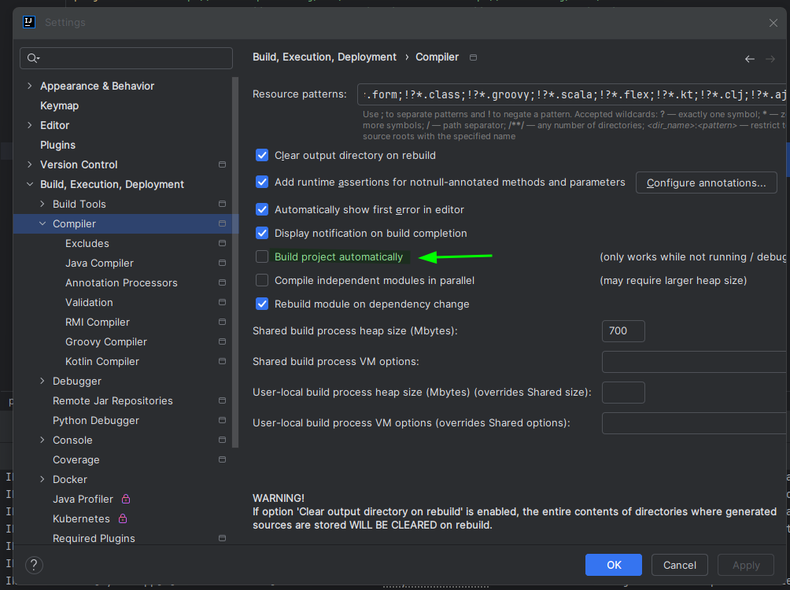
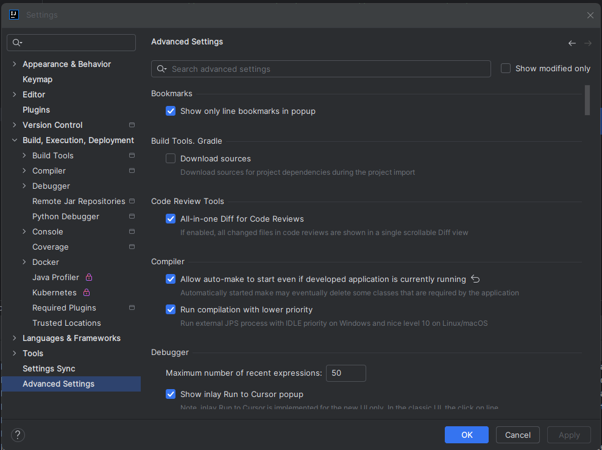

## Maven

### POM File
The POM file is your Project Object Model (**POM**) file.
It's always located in the root of your maven project.
### POM File Structure
  * **Project Meta Data** Project name, version, etc.(Output file type: JAR, WAR)
  * **Dependencies** List of projects we depend on Spring, Hibernate, etc. 
  * **Plug Ins** Additional custom tasks to run: generate JUnit test reports etc.
### Project Coordinates
Project Coordinates uniquely identify a project.
```xml
<groupId>name of company, group, or organization</groupId>
<artifactId>name for this project</artifactId>
<version>a specific release version or SPNAPSHOT is under active development</version>
```
[Maven dependencies web page](https://central.sonatype.com/)

## Spring Boot Dev Tools
Automatically restart your application when code is updated, you need to add this your `pom.xml` file.
```xml
<dependencies>
  <dependency>
    <groupId>org.springframework.boot</groupId>
    <artifactId>spring-boot-devtools</artifactId>
    <optional>true</optional>
  </dependency>
</dependencies>
```
### Intellij extra steps
Check the following options:



## Sprint Boot Actuator
Spring boot actuator is a sub-project of Sprint Boot, you can use this for management and metrics.
Add the following configuration at `pom.xml` file.
```xml
<dependency>
  <groupId>org.springframework.boot</groupId>
  <artifactId>spring-boot-starter-actuator</artifactId>
  <scope>test</scope>
</dependency>
```
`application.properties` file.
```
management.endpoints.web.exposure.include=*
management.info.env.enabled=true
```
After you can check this `http://localhost:8080/actuator/mappings` page which gives you information about the status of the exposed endpoints.
[Exposing Endpoints](https://docs.spring.io/spring-boot/docs/3.2.9/reference/html/actuator.html#actuator.endpoints.exposing)
[Reference for actuator](https://spring.io/guides/gs/actuator-service)
