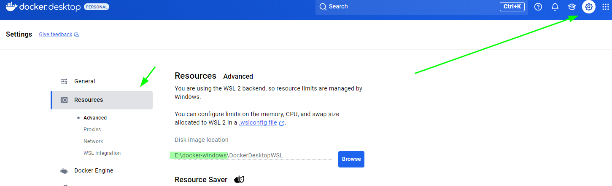

# Docker Notes

# Table Contents
* [Docker with postgresql](#docker-with-postgresql)

## Install Docker

### Windows
* [Windows](https://docs.docker.com/desktop/install/windows-install/)

You need to check this [video](https://www.youtube.com/watch?v=e3Ovu-STOis) if you're have some virtual machine working on your pc(`bcdedit /set hypervisorlaunchtype auto`)

**Restart your virtual machines**
If you have this error:
 `VMware Workstation and Device/Credential Guard are not compatible. VMware Workstation can be run after disabling Device/Credential Guard. Please visit http://www.vmware.com/go/turnoff_CG_DG for more details`

We need to follow the next step:
* Run ``bcdedit /set hypervisorlaunchtype off`` to disable hypervisor Close the command prompt after   executing the commands and restart the system.

## Move Docker data where images and containers on Windows
When we want to move the storage location for containers and images check the **Disk image location** use the configuration below. [More](https://docs.docker.com/desktop/settings-and-maintenance/settings/#advanced)



## Move Docker data directory to another location on ubuntu

* Stop docker daemon
```bash
sudo service docker stop
```
* Add a docker configuration file to tell docker daemon what is the location of the data directory, this files is located at ``/etc/docker/daemon.json`` but it's not there create a new one and add the following configuration.
```bash
{
  "data-root": "/path/to/your/docker"
}
```
* Copy the current data to the new one
```bash
sudo rsync -aP /var/lib/docker/ /path/to/your/docker
```
* Rename the old docker directory
```
sudo mv /var/lib/docker /var/lib/docker.old
```
* Restart docker daemon
```bash
sudo service docker start
```
* If everything is ok remove the old docker directory
```bash
sudo rm -rf /var/lib/docker.old
```

## Docker With Postgresql
Start with the instruction `start a postgres instance`, the command below will create a new container with a new name like `new-psql-container`:

```
$ docker run --name new-psql-container -e POSTGRES_PASSWORD=mysecretpassword -d postgres
```

The default variable that we have is `POSTGRES_USER=postgres`, this can be modified like:
```bash
docker run --name cat-psql-container \
  -e POSTGRES_USER=catuser \
  -e POSTGRES_PASSWORD=thecatpassword \
  -p 5432:5432  \
  -d postgres:alpine
```

### Connect with docker container
#### Using console
Once you create a container if you want to get into the container you can exectute the following command:
```bash
docker exec -it <container-name> bash
```
This will redirect you inside the running container once there you can connect with postgres terminal:
```bash
psql -U catuser -W
```
After you wrote the password you'll be able to execute the postgresql command you need.
#### Using SQLTool VS Code extension


Check also this [references](https://docs.docker.com/engine/reference/commandline/run/) if you want to know what means `docker run, --name -e`

* [Official Image Link](https://hub.docker.com/_/postgres)

## Commands

### docker start
Start one or more stopped containers
```
docker start [OPTIONS] CONTAINER [CONTAINER...]
```